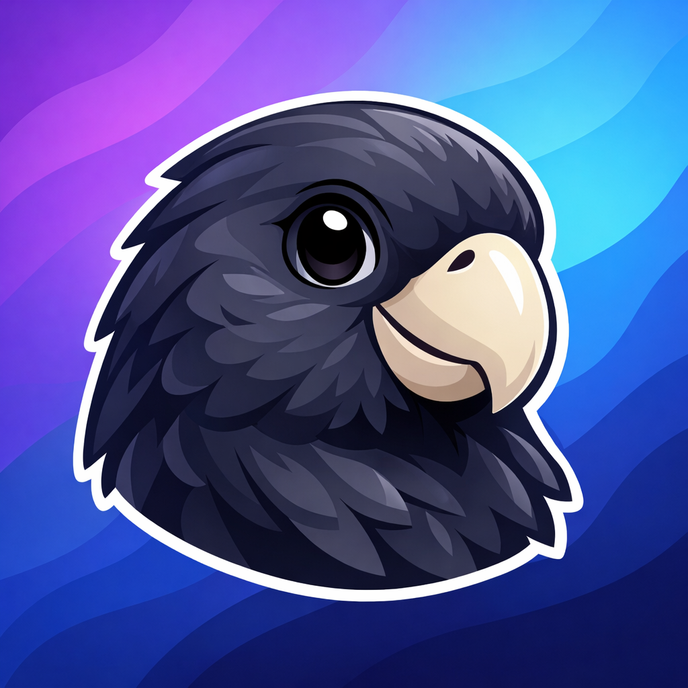

# Welcome to Kato-bot



This is OCEAN AI's custom discord moderation bot.

We use Kato (named after "Kato Nwar", the Seychelles endemic black parrot) to help maintain our community code of conduct.

We want the discord environment to be safe and usable by all who want to be a part of the community. We also believe in getting moderation tools set up early so that we prevent any major incidents before they happen.

Of course, Kato's reach is limited to the OCEAN AI server only and cannot moderate private chats.

We ask our members to be sensible and respectful of each other, wherever they might meet and interact.

## Development

### Setup
```bash
# Install dependencies
make install

# Install pre-commit hooks (recommended)
make pre-commit-install
```

### Quick Commands
Use the Makefile for common tasks:
```bash
make help              # See all available commands
make test              # Run tests with coverage
make lint              # Check code quality
make format            # Auto-format code
make run               # Run bot locally
make docker-up         # Start with Docker
make clean             # Clean up generated files
```

### Running Tests
```bash
# Run all tests
uv run pytest tests/

# Run with coverage report
uv run pytest tests/ --cov=bot --cov-report=term-missing

# Run specific test file
uv run pytest tests/integration/test_welcome.py -v
```

### Code Quality
```bash
# Run linter
uv run ruff check .

# Auto-fix linting issues
uv run ruff check --fix .

# Format code
uv run ruff format .
```

### Pre-commit Hooks
Pre-commit hooks run automatically before each commit to catch issues early:
- Ruff linting and formatting
- Trailing whitespace removal
- YAML validation
- Large file detection
- Test suite execution

### CI/CD Pipeline
The project uses GitHub Actions for continuous integration:
- **Linting**: Ruff checks code style and quality
- **Formatting**: Ensures consistent code formatting
- **Testing**: Runs full test suite with coverage reporting
- **Coverage Threshold**: Maintains 50% code coverage minimum (will increase as features are added)

All checks must pass before merging pull requests.
